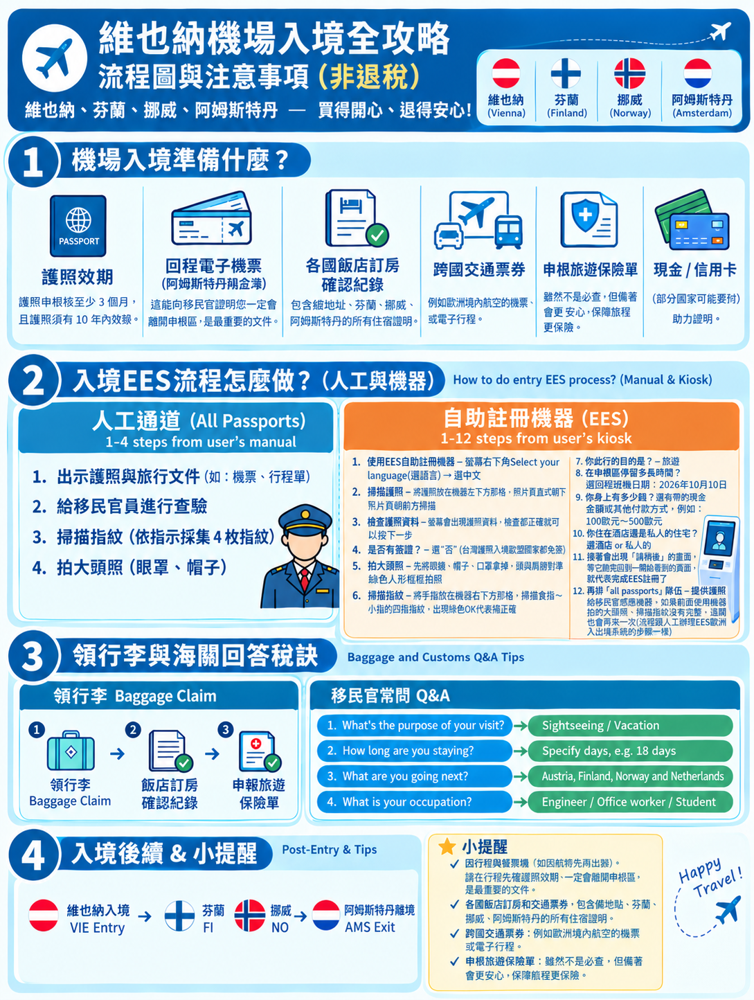

# Europe Trip 2026 — 網頁設計與維護規範

> 本 README 是本專案的 **UI / Web Design Source of Truth**。
> 任何 AI、協作者或未來維護者，在修改網站前都應先閱讀本文件，並遵守以下結構與視覺規範。

## 1. 專案目的

這是一個歐洲旅行規劃網站。網站的重點是：

- 手機與桌面都好讀
- 保留目前既有的視覺設計、色彩、卡片、時間軸與互動方式
- 讓不同功能可以由不同人 / AI **分開修改，避免所有人同時修改 `index.html`**
- 內容與 UI 結構清楚、容易長期維護

## 2. HTML 必須拆分，不要把所有內容塞進 `index.html`

### 核心規則

**新增功能時，原則上必須新增獨立 HTML，不要繼續把所有功能加進 `index.html`。**

首頁 `index.html` 應保持精簡，主要負責：

- 網站首頁 / 導覽
- 功能入口
- 連結到各功能頁
- 少量全站共用內容

目前主要功能分類：

- `每日行程`
- `交通`
- `住宿`
- `行前與工具`
- `預算`

建議結構：

```text
index.html
assets/
  common.css
  common.js

daily/
  index.html

transport/
  index.html

stay/
  index.html

prep-tools/
  index.html

budget/
  index.html
```

### 大型功能可以繼續往下拆

如果某個功能變得很大，可以在該功能自己的 folder 裡再拆成多個 HTML。

例如：

```text
transport/
  index.html
  flights.html
  trains.html
  local.html
```

或：

```text
prep-tools/
  index.html
  passport.html
  entry-process.html
  tax-refund.html
```

**原則：同一功能的子頁放在同一個 folder，不要散落在專案根目錄。**

## 3. 圖片規範：統一 PNG

如果新增或修改網站圖片：

1. **優先上傳 PNG 格式**
2. 放到 `assets/` folder
3. HTML / CSS 使用相對路徑 reference
4. 不要把圖片直接嵌入 HTML 的 base64
5. 不要把圖片散落在各功能 folder，除非未來有非常明確的圖片管理需求

例如：

```text
assets/
  vienna-entry-3x4.svg.png
  norway-tax-refund.png
```

HTML：

```html

```

根目錄頁面則使用：

```html

```

### 圖片檔名

使用容易理解的英文檔名，避免空白與特殊字元：

```text
vienna-entry-3x4.svg.png
norway-tax-refund.png
hotel-map-amsterdam.png
```

## 4. CSS / JavaScript 優先共用

不要每個 HTML 都複製一份完整 CSS / JavaScript。

全站共用的：

- 顏色
- 字體
- 卡片
- 按鈕
- spacing
- responsive layout
- 導覽列
- 基本互動

應盡量放在：

```text
assets/common.css
assets/common.js
```

功能頁只放該功能真正需要的特殊 CSS / JS。

### 重要

如果要改「整個網站的視覺風格」，優先修改 `assets/common.css`，不要逐頁複製修改。

如果要改「全站共用互動」，優先修改 `assets/common.js`。

## 5. UI / Design 原則

新增功能時，**延續目前網站的設計，不要任意換成另一套 UI framework 或風格。**

除非使用者明確要求，否則：

- 不要大幅改變現有配色
- 不要把卡片全部改成另一種風格
- 不要移除現有 responsive 行為
- 不要移除既有互動功能
- 不要為了新增功能而破壞既有頁面
- 不要把桌面版設計當成唯一設計，手機版也要檢查

目前網站的設計重點包括：

- 清楚的區塊層級
- 卡片式資訊呈現
- 行程 Day 1–18 的視覺導覽
- 國家時間軸
- 可橫向滑動的 Day / country navigation
- 手機友善的 responsive layout

## 6. 修改既有功能的規則

修改前先確認：

1. 這個功能屬於哪個分類？
2. 它應該修改哪一個功能 folder？
3. 是否能只修改該功能頁，而不碰 `index.html`？
4. 是否可以使用 `assets/common.css` / `assets/common.js` 的共用能力？

**能不改 `index.html` 就不要改 `index.html`。**

如果只是修改「住宿」內容，就修改 `stay/`；
如果只是修改「交通」，就修改 `transport/`；
不要順手把其他功能一起改掉。

## 7. 新增功能的標準流程

新增功能時依照：

```text
1. 判斷功能分類
        ↓
2. 建立該功能 folder
        ↓
3. 建立 index.html
        ↓
4. 大型功能再拆 sub HTML
        ↓
5. 圖片放 assets/，統一 PNG
        ↓
6. 共用 UI 使用 common.css / common.js
        ↓
7. 在根目錄 index.html 加一個入口連結
        ↓
8. 檢查手機 / 桌面版
        ↓
9. 確認沒有破壞其他功能
```

## 8. AI 修改網站時必須遵守

給任何 AI agent / coding AI 的最低要求：

### 必須

- **先讀 README.md，再修改網站。**
- 先確認目前檔案結構。
- 優先修改正確的功能 folder。
- 新功能建立獨立 HTML。
- 大型功能拆成同一 folder 的 sub HTML。
- 新增圖片使用 PNG 並放進 `assets/`。
- 共用 CSS / JS 優先使用 `assets/common.css` / `assets/common.js`。
- 保留既有 UI / UX，除非使用者要求重新設計。
- 修改後檢查所有受影響的相對路徑。
- 修改後確認 GitHub Pages 的路徑仍然正確。

### 禁止

- 不要把新的大型功能全部塞進 `index.html`。
- 不要複製一整份 CSS / JS 到每個頁面。
- 不要把圖片放在根目錄亂散。
- 不要新增 JPG / JPEG 來取代既定的 PNG 規範，除非有明確技術原因並獲得同意。
- 不要任意刪除既有內容。
- 不要為了「整理」而順手重做整個 UI。
- 不要修改與目前任務無關的功能。

## 9. Git / 協作原則

本專案會由多人或多個 AI 同時維護，因此 **降低檔案衝突是重要設計目標**。

理想狀態：

```text
AI #1 → daily/index.html
AI #2 → transport/index.html
AI #3 → stay/index.html
AI #4 → prep-tools/index.html
AI #5 → budget/index.html
```

只有需要新增網站入口時才修改根目錄 `index.html`。

如果某次修改只屬於單一功能，commit 也盡量只包含該功能相關檔案。

## 10. 完成修改前的 Checklist

- [ ] 有先閱讀 README.md
- [ ] 新功能沒有全部塞進 `index.html`
- [ ] HTML 放在正確的功能 folder
- [ ] 大型功能已依需要拆成 sub HTML
- [ ] 圖片是 PNG
- [ ] 圖片放在 `assets/`
- [ ] HTML / CSS 圖片路徑正確
- [ ] 共用 CSS / JS 沒有重複複製
- [ ] 保留既有 UI / UX
- [ ] 手機版正常
- [ ] 桌面版正常
- [ ] 沒有誤刪既有內容
- [ ] 沒有修改與本次任務無關的功能

---

## 一句話規則

> **小功能獨立 HTML，大功能獨立 folder + sub HTML；圖片統一 PNG 放 `assets/`；共用 UI 放 `common.css / common.js`；`index.html` 只做首頁與導覽。**

<!-- rebuild trigger -->
